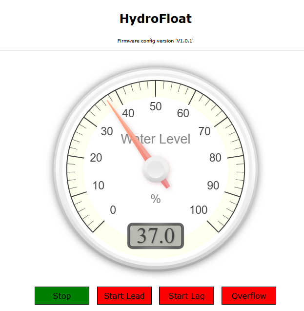

# HydroFloat
## Piezoelectric Submersible Level Sensor using ESP32 X4 Relay board. 
#### Similar to the FloatLevel project but does not have MQTT, Modbus. Wifi runs in AP mode only.
#### Relays are triggered at configurable water levels

<a href="https://www.buymeacoffee.com/r4K2HIB" target="_blank"></a>

<p align="left">
  
  
</p>
 
This project is based on the ESP32, it works with a Submersible Level Sensor 4-20ma Pressure Sensors.

|<a href="https://www.aliexpress.com/item/1005005275943365.html"> ESP32 X4 Relay Board</a>||
|---|---|
|<a href="https://www.aliexpress.com/item/1005006366841583.html"> Piezoelectric Submersible 4-20mA Level Sensor </a>||

## Wiring

Device Pin | ESP32 |
--- | --- |
FloatLevel red  | 24VDC |
Use 135Ω (2 X 270Ω in parallel) from A0 to GND
FloatLevel black | A0 |

<p align="left">
  
</p>

Used the following development tools;

<ul>
  <li>Visual Studio Code with the PlatformIO extension.</li>
  <li>Access Point is HydroFloat, use the default 12345678 as the AP password. Browse 192.168.4.1 and go to Configuration Page to set the levels.
</ul>


## License
```

 Copyright (c) 2025. ClassicDIY

  Unless required by applicable law or agreed to in writing, software
  distributed under the License is distributed on an "AS IS" BASIS,
  WITHOUT WARRANTIES OR CONDITIONS OF ANY KIND, either express or implied.
  See the License for the specific language governing permissions and
  limitations under the License.

```

